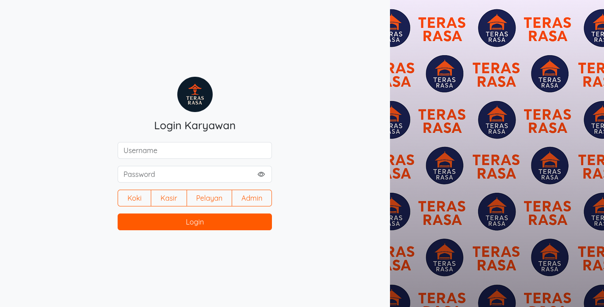

# RMS Teras Rasa


## Deskripsi Proyek
RMS (Restaurant Management System) Teras Rasa adalah sistem manajemen restoran yang dirancang untuk memudahkan pengelolaan operasional restoran secara digital. Proyek ini dikembangkan sebagai tugas mata kuliah Rekayasa Perangkat Lunak 1.

## Teknologi yang Digunakan
<!-- Sesuaikan dengan teknologi yang benar-benar digunakan -->
- **Frontend**: HTML, CSS, JavaScript
- **Backend**: JavaScript (NodeJS)
- **Database**: MySQL
- **Framework**: Express, EJS

## Instalasi dan Setup

### 1. Clone Repository
```bash
git clone https://github.com/Ims4d/RMS-Teras-Rasa.git
cd RMS-Teras-Rasa
```

### 2. Install Package
```bash
npm install
```

### 3. Setup Database
```sql
-- Buat database baru
CREATE DATABASE teras_rasa;

-- Import schema database
mysql -u username -p teras_rasa < teras_rasa.sql
```

### 4. Setup .env
```bash
PORT=

DB_HOST=
DB_USERNAME=
DB_PASSWORD=
DB_NAME=teras_rasa

SESSION_SECRET=
```

### 4. Jalankan Aplikasi
```bash
npm start
```

---
*Dikembangkan untuk memenuhi tugas besar mata kuliah Rekayasa Perangkat Lunak 1*
